# # Ejercicio Linux - Capitulo 2

[TOC]

## Comandos Utilizados


## Ejercicios Prácticos

1. ¿En qué directorio se encuentran los ficheros de configuración del sistema?

​	Los ficheros de la configuración del sistema se encuentran en el directorio /etc

2. Para entrar en un sistema Linux hace falta a) nombre de usuario, contraseña y dirección IP, b) nombre de usuario y contraseña o c) únicamente una contraseña..

   Nombre de usuario y contraseña

3. Muestra el contenido del directorio actual. 

   

   ```
   $ ls
   ```

   

4. Muestra el contenido del directorio que está justo a un nivel superior

   

6. ¿En qué día de la semana naciste?, utiliza la instrucción cal para averiguarlo

   ```
   $ cal 9 2006
   ```

   
   
   6. Muestra los archivos del directorio /bin
   
   ```
   $ ls /bin
   ```
   
   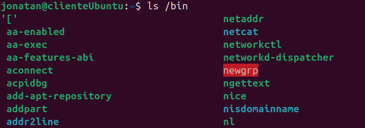

7. Suponiendo que te encuentras en tu directorio personal (/home/nombre), muestra un listado del contenido de /usr/bin a) con una sola línea de comando, b) moviéndote paso a paso por los directorios y c) con dos líneas de comandos.

a) 

```
$ ls /usr/bin
```

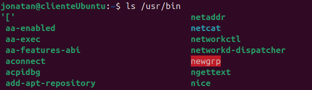

b)

```
$ cd/
$ cd usr     
$ cd bin     
$ ls 
```

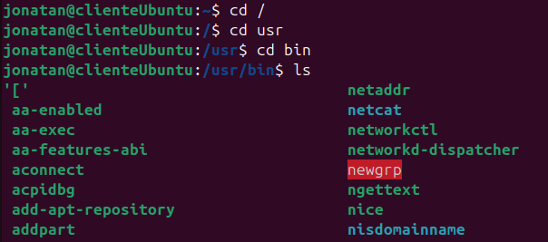

c)

```
$ cd /usr/bin
$ls
```

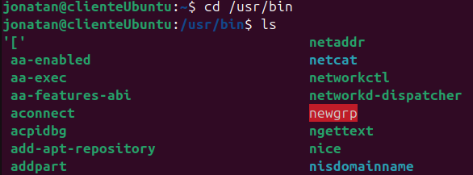

8. Muestra todos los archivos que hay en /etc y todos los que hay dentro de cada subdirectorio, de forma recursiva (con un solo comando).

```
$ ls -R / etc
```

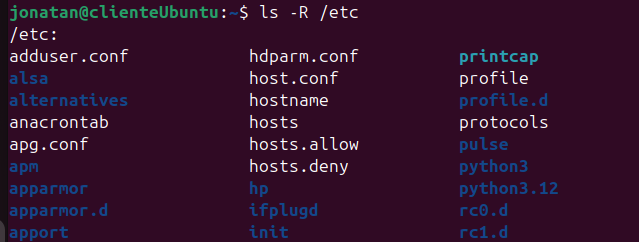

9. Muestra todos los archivos del directorio /usr/X11R6/bin ordenados por tamaño (de mayor a menor). Sólo debe aparecer el nombre de cada fichero, sin ninguna otra información adicional.

```
$ ls -S /usr/X11R6/bin
```

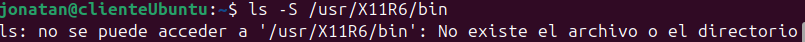

10.  Muestra todos los archivos del directorio /etc ordenados por tamaño (de mayor a menor) junto con el resto de características, es decir, permisos, tamaño, fechas de la última modificación, etc. El tamaño de cada fichero debe aparecer en un formato “legible”, o sea, expresado en Kb, Mb, etc.

    ```
    $ ls -lhS /etc
    ```

    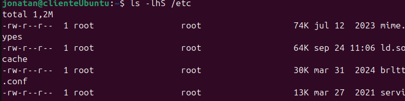

11.  Muestra todos los archivos del directorio /bin ordenados por tamaño (de menor a mayor). Sólo debe aparecer el tamaño y el nombre de cada fichero, sin ninguna otra información adicional. El tamaño de cada fichero debe aparecer en un formato “legible”, o sea, expresado en Kb, Mb, etc.

    ```
    $ ls -lhS /bin
    ```

    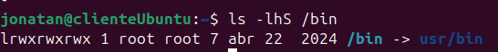

    12.Muestra el contenido del directorio raíz utilizando como argumento de ls una ruta absoluta.

    ```
    $ ls /
    ```

    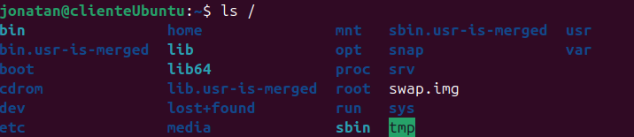

13. Muestra el contenido del directorio raíz utilizando como argumento de ls una ruta relativa. Suponemos que el directorio actual es /home/elena/documentos.

    ```
    $ ls ../../..
    ```

    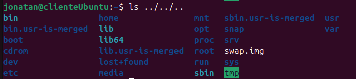

14. Crea el directorio gastos dentro del directorio personal.

    ```
    $ mkdir ~/gastos
    ```

    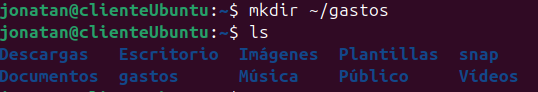

15. ¿Qué sucede si se intenta crear un directorio dentro de /etc?

    ```
    $ mkdir /etc/nuevo_directorio
    ```

    Para que funcione necesitamos permisos de administrador y para eso escribiríamos sudo delante del mkdir 

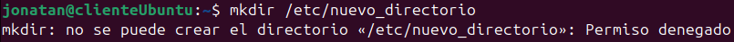

16 .Muestra el contenido del fichero /etc/fstab

```
$ cat /etc/fstab
```

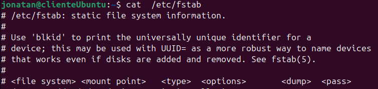

17. Muestra las 10 primeras líneas del fichero /etc/bash.bashrc

    ```
    $ head /etc/bash.bashrc
    ```

    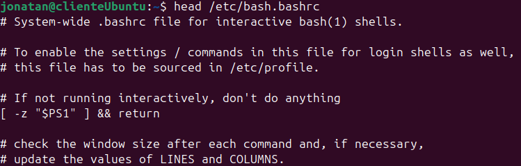

18. Crea la siguiente estructura de directorios dentro del directorio de trabajo personal:

    ```
    $ mkdir trabajoPersonal
    $ cd trabajoPersonal
    $ mkdir multimedia
    $ cd multimedia
    $ mkdir musica
    $ mkdir imagenes
    $ mkdir video
    $ mkdir presentaciones
    $ cd imagenes
    $ mkdir personales
    $ mkdir otras
    ```

    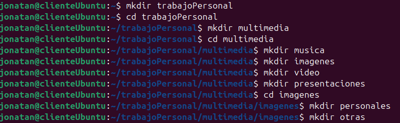

    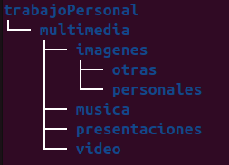

    

## Ejercicios Prácticos Comandos

1. Crea un archivo prueba.txt y dale permisos rw-r----- usando modo simbólico.

   ```
   $ touch prueba.txt
   $ chmod u=rw,g=r,o= prueba.txt
   ```

   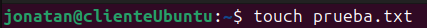

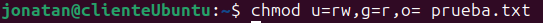

2. Haz que solo el grupo pueda escribir en notas.txt .

   ```
   $ touch notas.txt
   $ chmod g+w,u-w,o-w notas.txt
   ```

   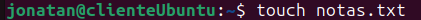

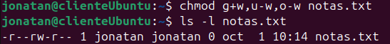

3. Cambia el propietario de tarea.doc a ana y el grupo a profes .

```
$ sudo adduser ana
$ sudo groupadd profes
$ touch tarea.doc
$ sudo chown ana:profes tarea.doc
```

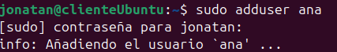

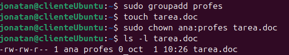

4. Quita todos los permisos a otros sobre config.cfg

   ```
   $ chmod o-rwx config.cfg
   ```

   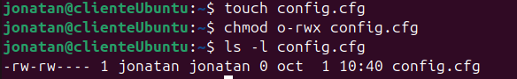

5. Pon rwx a todos en un script llamado run.sh .

   ```
   $ touch run.sh
   $ chmod 777 run.sh
   ```

   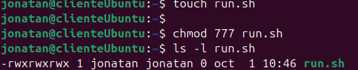