# Introducción de virtualbox Instalación de la máquina Cliente Ubuntu

[TOC]

## 1 -Configuración de VirtualBox

Lo primero escogemos el modo *Expert*

Añadir una red de tipo NAT para poder conectar varias maquinas virtuales

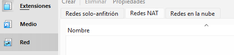

Configuramos la red:

## 2 - Creación de la nueva maquina

Establecemos los parámetros de la Nueva Maquina:

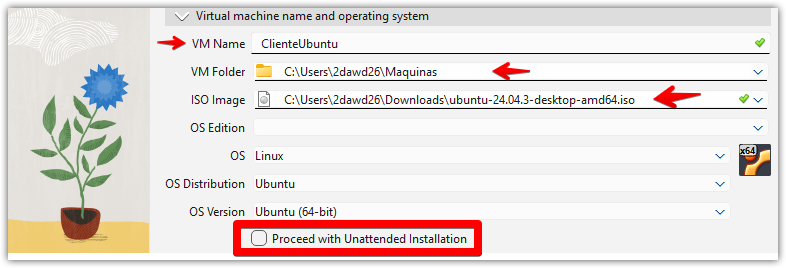

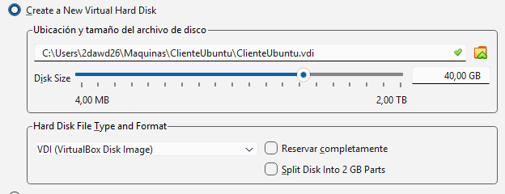

Podemos ver la nueva máquina:

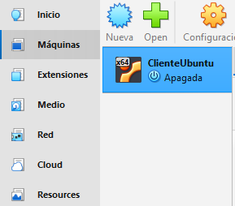

Cambiamos algunos ajustes:

- En la **descripción**  guardamos el usuario y la contraseña de la máquina:

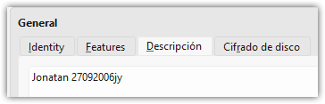

- Deshabilitamos el **Audio**:

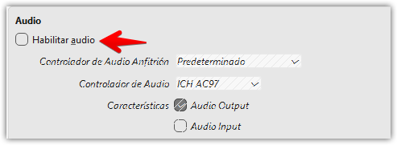

- El adaptador Red debe ser Red Nat:

  

  

  # 3 - Configuración de la máquina virtual

  

  

  

  

  # 4 - Instalación guest adittions

  

  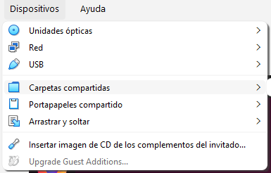

  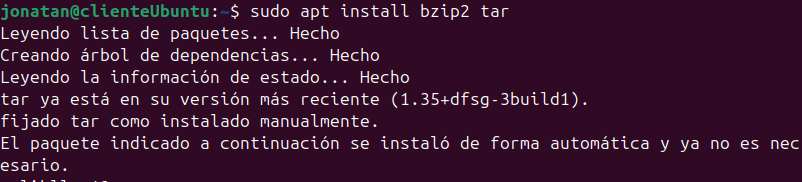

  

  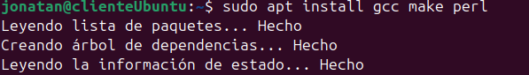
  
  Carpetas Compartidas
  
  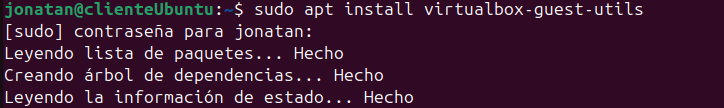
  
  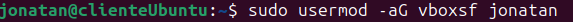